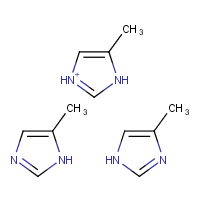

constph-OpenMM: Protonation states and tautomers for OpenMM
***********************************************************

.. Note::

    This is module is undergoing heavy development. None of the API calls are final.

Introduction
============

This python module implements a sampler for amino acid and small molecule protonation states and tautomers in OpenMM.

It has the following requirements:

* python 2.7, 3.4 or 3.5
* openmm 7.0rc1
* numpy >=1.10
* scipy >=0.17.0
* openmmtools 0.7.5
* pymbar
* openmoltools 0.7.0
* ambermini
* joblib
* lxml

Table of contents
-----------------

.. toctree::
   :name: mastertoc
   :maxdepth: 2

   modules/constph
   modules/cnstphgbforces
   modules/calibration
   modules/ligutils
   modules/logger
   modules/generate_calibration_systems
   modules/tests

Indices and tables
==================

* :ref:`genindex`
* :ref:`modindex`
* :ref:`search`

